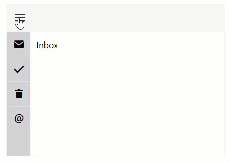

<!-- default badges list -->

<!-- default badges end -->
# DevExtreme Drawer - Getting Started

This repository stores the code examples of the Drawer component for the [Getting Started with Drawer](https://js.devexpress.com/Documentation/Guide/UI_Components/Drawer/Getting_Started_with_Navigation_Drawer/) tutorial. This tutorial creates a Drawer that allows a user to switch between pages. Users can click a button on the toolbar to open and close the Drawer.

## Files to Review

- **Angular**
    - [app.component.html](angular/src/app/app.component.html)
    - [app.component.ts](angular/src/app/app.component.ts)
- **jQuery**
    - [index.js](jquery/src/index.js)
- **React**
    - [App.js](react/src/App.js)
- **Vue**
    - [App.vue](vue/src/App.vue)
- **ASP.NET MVC**    
    - [Index.cshtml](aspnetmvc/GettingStartedWithDrawer/Views/Home/Index.cshtml)

## Documentation

- [Getting Started with Drawer](https://js.devexpress.com/Documentation/Guide/UI_Components/Drawer/Getting_Started_with_Navigation_Drawer/)

- [Drawer - API Reference](https://js.devexpress.com/Documentation/ApiReference/UI_Components/dxDrawer/)
